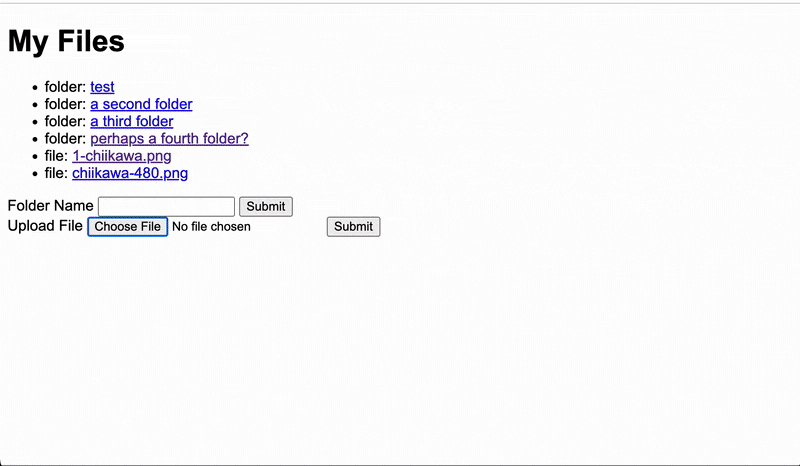

<h1 align="center">File Castle</h1>
<h3 align="center">Simple file storage website</h3>

    

### Description

- Upload and download files
- Organize your files by creating folders
- Only authorized user accounts may upload files and create folders

### Features

- Create an account to upload files and create folders
- Upload and download files stored on the cloud (supabase)
- Create folders to store files

### Stack

-   Prisma ORM - PostgreSQL
-   NodeJS, Express
-   HTML, EJS, CSS
-   Cloud storage service: Supabase
-   Notable libraries: 
    - Multer (file upload)
    - Supabase (Cloud storage)
    - Prisma (ORM)

## Learning Outcomes

- Configuring <a href="https://expressjs.com/en/resources/middleware/multer.html">Multer</a> 
    - Save files to local memory
    - Serve downloaded files to user
- Configuring Supabase
    - Store files on the cloud
    - Serve file downloads to user
- First time using Prisma ORM

### Retrospective (aka yapping)

Configuring file upload and download with supabase was a doozy! Very satisfied with the end result though! Prisma ORM is actually quite convenient but I'm not sure how to make some queries that dont have joins... Decided not the style this project as there are many more projects in the future to work on. 

## Acknowledgements

| Usage   |     Source     |
| ------- | -------------- |
| Specs   | [The Odin Project](https://www.theodinproject.com/lessons/nodejs-file-uploader) |
